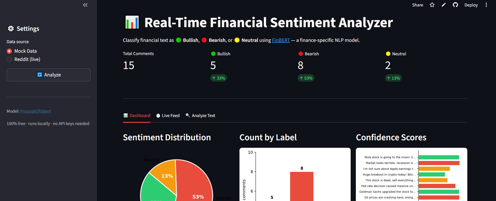
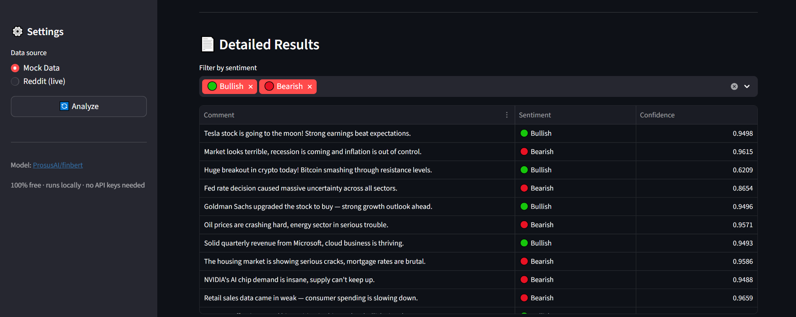

# Real-Time Financial Sentiment Analyzer

Classifies financial text as **Bullish**, **Bearish**, or **Neutral** using [FinBERT](https://huggingface.co/ProsusAI/finbert). Built with Streamlit. No paid APIs.

🚀 **[Live Demo → ai-text-analyzer-turgutpeker.streamlit.app](https://ai-text-analyzer-turgutpeker.streamlit.app/)**

## Features

- Bullish / Bearish / Neutral sentiment classification with confidence scores
- Interactive dashboard with charts and a filterable results table
- Live Feed — watch comments get classified one by one
- Live Reddit data from r/stocks, r/investing, r/wallstreetbets
- Custom text input — analyze any headline instantly

## Tech Stack

- **Model:** FinBERT (ProsusAI/finbert)
- **Framework:** HuggingFace Transformers + PyTorch
- **Dashboard:** Streamlit + Matplotlib
- **Data:** Mock data or Reddit public API
- **Language:** Python 3.10+

## Screenshots




## Run Locally

```bash
pip install -r requirements.txt
streamlit run app.py
```
